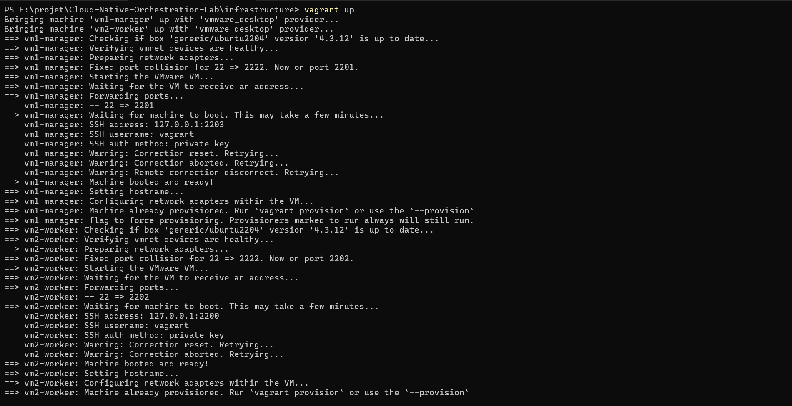
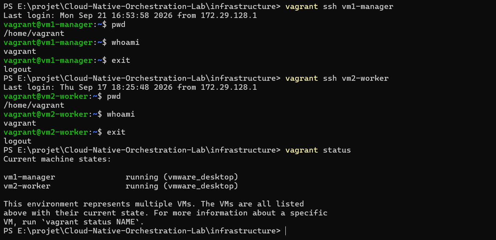
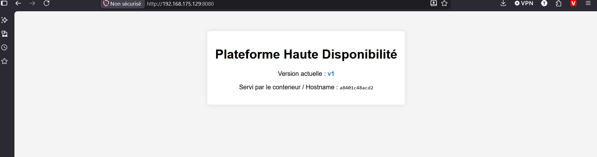
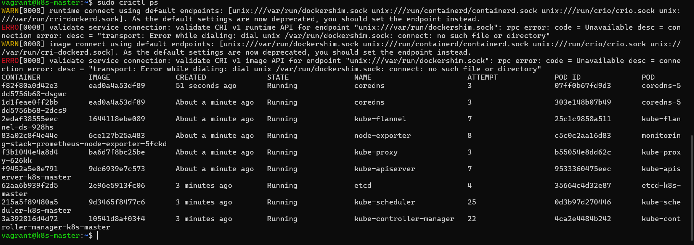
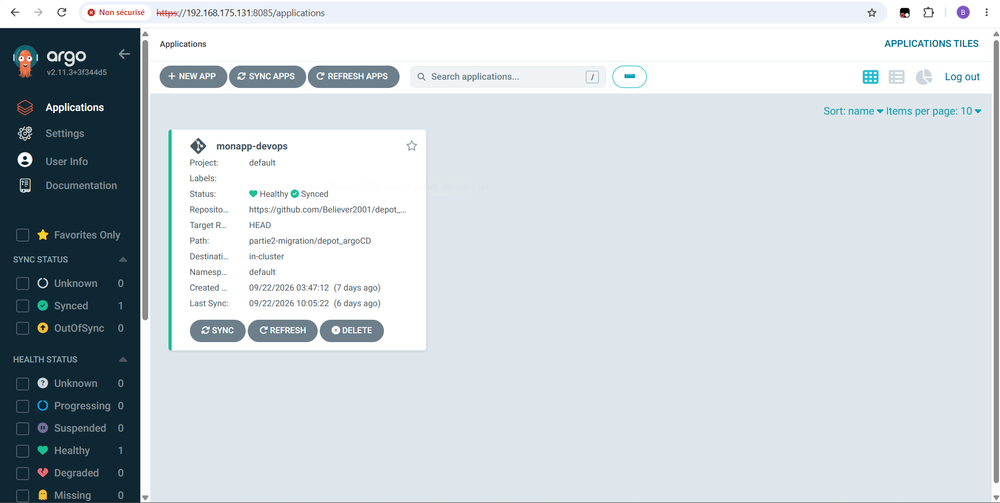
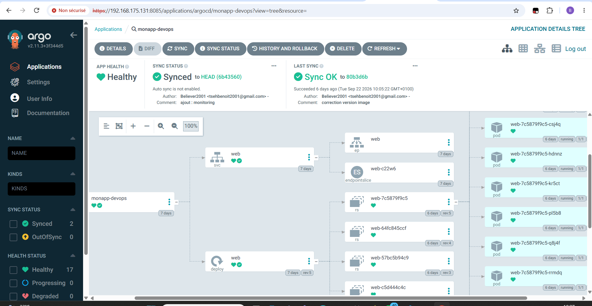

### Realistation du projet

#### Phase  1 

1. **Provisionnement automatisé**

Pour automatiser le provisionnement de façon automatique nous avons  installer le logiciel vagrant  que nous avons utiliser avec  *VMware* :

 - Nous définissons les  différentes configuration de nos machines virtuelles dans le fichier `Vagrantfile`[vagrantfile](./infrastructure/Vagrantfile).

 - Nous lançons les machine virtuelle grâce à la commande 

 ```Bash

 vagrant up
  
 ```
 

 Après cette commande nos machines sont bien lancer et  sont accessible  avec  le protocole `ssh`:
 

 2. Déploiement  du cluster  *Docker swarm*

 - Pour de ploument du  cluster *Cluster docker swarm* nous   avons structurer le projet la configurations dans un [`playbook ansible`](./infrastructure/ansible/playbook.yml) et   un  fichier [inventory](./infrastructure/ansible/inventory)
 
 - Pour le déployment de notre application  vous avons défini un fichier [docker-compose](./application/docker-compose.yml)  que nous avons exécuté   dans un fichier playbook [playbook deploiement](./infrastructure/ansible/deploy-app.yml)  

 - Nous  exécutons avec la commande : 

 ```Bash
 ansible-playbook -i invenotry.ini playbook.yml
 ansible-playbool -i inventory.ini deploy-app.yml
 
 ```

 Après ce deploiement nous pouvons  notre application web et constater  l'équiblagre des charges.

 #### Phase 2

1. Provisionnement de machine virtuelle

Comme précédement nous allons provionner des machine virtuelle via vagrant qui vont servir d'infrastructure de  migration. Le fichier [vagrantfile](/partie2-migration/Vagrantfile) contient ainsi les configurations nécéssaires pour faire tourner  kubernestes.

2. Deploiement de kubernetes 

Pour le deploiement de Kubernetes , nous allons  utiliser  faisons la configuration de nos fichiers playbook contenant  les differents play permettant le setup eet l'initilisation cluster :

- [setup des noeuds](./partie2-migration/ansible/setup-k8s-nodes.yml)

- [initilisation du k8s](./partie2-migration/ansible/initialisation-k8s.yml)

On peux alors voir  via la commande  bas niveau ``crictl` les machines  conteneurs composantes due ce kubernestes notamment: 
- API server
- Kube-schelduler
- Kube-manager
- etcd ( fait l'office de base de donnée du cluster)




Nous deploions ainsi ArgoCD pour automatiser le deploiement de notre   application. Pour ce faire nous disposons du fichier de  [argocd deployement](./partie2-migration/ansible/depolyement-argocd.yml) qui contient les plays du déployement.




Nous pouvons proccéder au déployement de notre web app via le  des  `git push` où nous avons les images. Pour le déployement nous avons.


